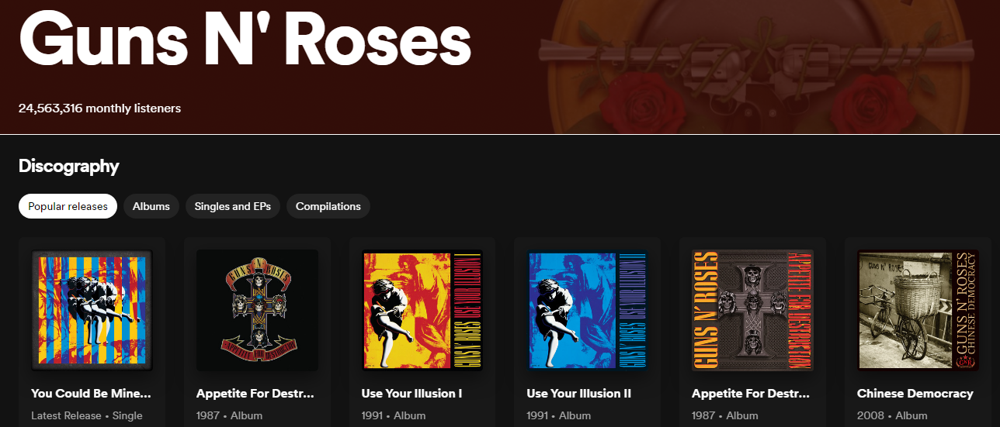
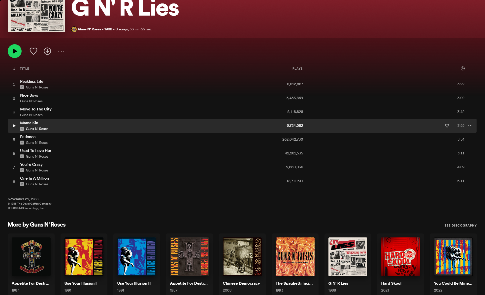
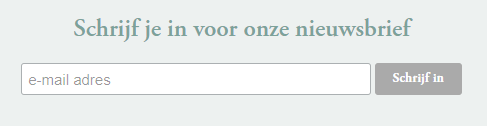

# PE1 opdracht

Maak voor deze opdracht een Blazor Server applicatie die communiceert met de Spoticlone API.

Laat je hiervoor inspireren door bestaande applicaties zoals Spotify, Apple Music, Deezer, YouTube Music, ...

## Vereisten

Je maakt in Blazor Server een web applicatie die de data van de API visualiseert in je web applicatie. 

### Voorzie volgende pagina's:

- Een overzichtspagina met alle artiesten aanwezig in de database. Dit is dan ook de 'homepage' van je applicatie.

- Wanneer er geklikt wordt op een artiest uit de homepage dient men terecht te komen op een pagina waarop je het volgende voorziet:
	- enkele details van deze artiest, denk hierbij aan followers, popularity, ...
	- alle albums van deze artiest. Voorzie elk album van een link naar de albumdetail pagina.
	- gelijkaardige artiesten binnen hetzelfde genre of genres. Voorzie een link naar detailpagina van deze artiesten.

- Wanneer er geklikt wordt op een album toon je het volgende: 
	- de details van dit album
	- alle nummers van dit album met alle details per nummer (explicit, discnummer, tracknummer, duur, ...)
	- Voorzie je de mogelijkheid om CRUD te voorzien op de tracks van dit album. Het moet mogelijk zijn om tracks toe te voegen aan het album, te verwijderen, en te bewerken.
	- Toon je andere albums van deze artiest. 
	- Je voorziet een pagina die de data toont die je verkrijgt door het statistics endpoint aan te spreken van de API.

- Naast je homepage voorzie je nog een pagina die statistieken toont:
	- gebruik hiervoor het reeds bestaande `api/Statistics` endpoint. 
		- Let op, dit endpoint moet een query parameter (totalItems) meesturen.
		- Zorg ervoor dat de gebruiker kan kiezen tussen een top 3, top 5 of top 10 als waarde van `totalItems`
	- De data die je verkrijgt giet je in een mooie UI in je Blazor page.

## Navigatie
Je voorziet slechts twee items in de navigatie van je website:
- Home
- Statistieken

Je voorziet geen andere links in je navigatie.

## Voorbeelden:

## Uitwerking

- Je maakt zoveel mogelijk gebruik van Blazor componenten

- Je verzorgt de layout van je uitwerking, je maakt een grafisch verzorgde applicatie. Je mag hiervoor aan de slag met Bootstrap, ga hiervoor even op zoek naar de [Bootstrap componenten documentatie](https://getbootstrap.com/docs/5.0/getting-started/introduction/).

- Voorzie op **elke pagina** een mogelijkheid om in te schrijven in de Spoticlone nieuwsbrief. Een gebruiker dient hiervoor enkel zijn e-mailadres in te vullen. 
Na het klikken op een knop om in te schrijven verberg je de component en toon je een gepaste melding aan de gebruiker. Verder hoef je niks te doen, het e-mailadres dient dus niet in de database te worden bijgehouden.

Voorbeeld:

## Project aanmaken
Maak in de reeds voorziene solution een nieuwe Blazor Server project (in de **src** folder).

- Je communiceert enkel en alleen via HTTP requests met de API om data op te vragen en/of toe te voegen.
- Indien nodig voor je eigen uitwerking mag je endpoints van de API aanpassen en/of toevoegen
- Maak, waar nodig, gebruik van eigen componenten.
- Maak geen gebruik van externe Blazor UI frameworks.
